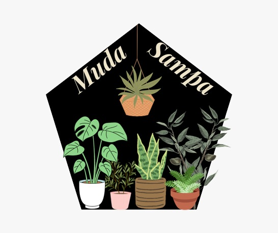

# TCC - Imersão Js | Projeto Muda Sampa

<div align="center">
  
</div>

> Status: **em construção**

<p align="justify">
  <a>
    
    
  </a>
</p>
<br>

## Proposta

Iniciativa que visa uma São Paulo mais verde, com a proposta de doação de mudinhas e voluntários para adotar as mesmas.

#### Objetivo

Desenvolver uma aplicação na qual você consiga visualizar as mudas de plantas que estão atualmente em doação, bem como você consegue cadastrar mudas para que outra pessoa adote.

## 💻 Informações Técnicas

## 4. Tecnologias utilizadas:

| Ferramenta      | Descrição                                      |
| --------------- | ---------------------------------------------- |
| `javascript`    | Principal linguagem de programação.            |
| `jest`          | Ferramenta de testes                           |
| `readline-sync` | Ferramenta para captura de inputs via terminal |

Requisitos mínimos para utilização:

- [Visual Studio Code]("https://code.visualstudio.com/download")
- [Node.js]("https://docs.npmjs.com/downloading-and-installing-node-js-and-npm")
- [Jest]("https://jestjs.io/docs/getting-started")

#### Passo a passo de como rodar:

Abra uma janela de terminal na pasta que deseja clonar o repo e digite os passos abaixo:

```
git clone https://github.com/clauprudente/on21-imersao-js-S12-Projeto-Muda-Sampa
cd on21-imersao-js-S12-Projeto-Muda-Sampa
```

Instale as dependências:

```
npm install
```

Rode a aplicação:

```
npm run start
```

Para rodar os testes:

```
npm run test
```

## Funcionalidades

- Cadastro de Usuários Voluntários
  > Esta funcionalidade tem como objetivo o cadastro no sistema de usuários que gostariam de se voluntariar para doação das mudinhas;
- Cadastro de mudinhas para doação
  > Esta funcionalidade, que está disponível apenas para usuários voluntários, tem como objetivo o cadastro de mudinhas para a doação
- Listagem de mudinhas para doação
  > Esta funcionalidade tem como o objeto a verificação dos nomes, quantidade e endereço das mudinhas para doação
- Adoção de mudinhas
  > Esta funcionalidade tem como o objetivo a adoção de mudinhas

## Melhorias futuras

- Para utilização do sistema, o usuário precisar estar logado, mesmo apenas para adoção de plantas.
- Irá ter 2 tipos de usuário.
- Transformar realmente em um sistema com um Front-end e conectado a um Banco de Dados.
- Implementar dicas de como cuidar das mudinhas adotadas
- Implementação de um mapa para achar as mudinhas mais próximas de você que estão em doação
- Melhorar a camada de segurança, trocando o endereço para um ponto de encontro ou colocando o telefone do voluntário para combinar a entrega

#### Autora

<a href = "mailto:claudia.mpsantos@outlook.com"> </a>
<a href="https://www.linkedin.com/in/claudiampsantos/" target="_blank"></a>
© 2022 </> com ❤️ por Cláudia Prudente
